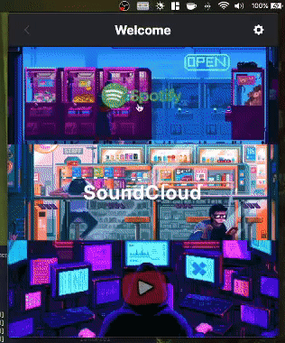

# music-menubar


[](https://www.buymeacoffee.com/aaronbleop)

tldr; a dropdown media controller for your youtube playlists / videos (and planned spotify + soundcloud controller too), written using React, Tailwind CSS and Electron

<p align="center">
  
</p>

### More deets

I'm always trying to create things to help improve my workflow, and while this app may only be a small improvement, it is more than enough for me.

A quick note, I will be using the term 'stream' throughout this readme when referring to some of the YouTube functionalities, but really any YouTube video will work. I just intended the usage to be a stream initially and so that is the verbage I adopted.

### Current state

Currently this media player is only capable of managing existing youtube playlists and streams. I originally had a spotify controller partly working, but decided to focus on one feature at a time. So, until the youtube portion is closer to where I want it to be I'll be shelving the spotify controls.

### Installation

Until a release has been made, you can follow the development startup procedure as follows:

```bash
git clone https://github.com/aaronleopold/music-menubar.git
cd music-menubar
```

Then, configure a `.env` file using the provided `.env.example` file. Once this step is finished, you can install the dependencies and run the program:

```bash
yarn
yarn dev
```

### Usage

Off the bat, this will come preloaded with three playlists and one stream. All of the preloaded items are Lofi, so if that's not your thing you can just delete them. To link new items, all that is required is pasting an appropriate link and assigning a name.

In the event that the URL parsing fails, you'll need to grab the ID from the URL manually. For playlists, this is the value that comes immediately after `?list=`, and for videos / streams this is the value that comes immediately after `?v=`.

For example, let's say you wanted to add the following playlist:

`https://www.youtube.com/playlist?list=PLm5pKYShxnXB1g2LixFdKxjAvl3P2O4Hm`

The ID to extract here is: `PLm5pKYShxnXB1g2LixFdKxjAvl3P2O4Hm`

Now, lets say you love this video:

`https://www.youtube.com/watch?v=rCFmLjGq3Jg`

The ID to extract here is `rCFmLjGq3Jg`.

### Artwork

I used a large amount (and still increasing) of gifs, and none of it is mine. Zip. All of the art you see is thanks to other people who have amazingly great talent, and the references to all gifs used can be found in `src/renderer/assets/gifs.ts`.You'll see an array of objects, and the source field is the source. Please take the time to check it out and give let the artist know if you happen across something you love!

For example:

```tsx
{
    gif: waneela,
    source: "https://giphy.com/gifs/cinemagraph-RkDZq0dhhYHhxdFrJB",
}
```

I will work on a more appropriate way of attributing these creators (i.e. see [`src/renderer/assets/attribution.md`](https://github.com/aaronleopold/music-menubar/blob/main/src/renderer/assets/attribution.md)), but until then please refer to the file above.

#### Contributing

I've started creating and annotating issues specifically for the start of Hacktober. Please allow issues marked as "good first issue" to be completed by those with less experience, as I intentionally set these aside. Additionally, please refer to the [CONTRIBUTING.md](https://github.com/aaronleopold/music-menubar/blob/main/CONTRIBUTING.md) for more general information.
